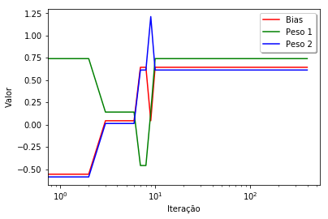

# Rede Adaline
Este é um artigo científico sobre aprendizado de funções booleanas linearmente separáveis utilizando rede adaline, utilizado como requisito de aprovação na matéria Tópicos Avançados no curso de Redes de Computadores do Instituto Federal Catarinense.<br/>
Autor: Rafael Gonçalves Figueira | 20 de Junho de 2018

O código em Python `Rede Adaline.py` foi criado como ferramenta de estudos para demonstrar como uma rede Adaline (_**Ada**ptive **Line**ar Neuron_) simples se comporta aprendendo funções booleanas com entradas linearmente e não linearmente separáveis.

A pasta `LaTeX` contém todo o código Markdown utilizado para criar o artigo científico formatado.

Abaixo está o artigo redigido, para uma melhor visualização, é aconselhável ler através do `Artigo Científico.pdf`.

# O artigo

### Aprendizado de Funções Booleanas Linearmente Separáveis Utilizando Rede Adaline

## Resumo

Este artigo apresenta o estudo e desenvolvimento de uma rede neural simples para aprendizado de operações da álgebra booleana por meio de algoritmo Adaline, os quais, visa demonstrar a capacidade de aprendizado das redes neurais artificiais e uma das suas possíveis aplicações. Os resultados mostram que para problemas linearmente separáveis a rede neural Adaline conseguiu aprender rapidamente e chegar nos resultados esperados, mas em cenários não linearmente separáveis como o “ou exclusivo” (), a rede foi incapaz de ser treinada. 

##### Palavras-chaves: Rede Neural, Adaline, Aprendizado de Máquina, Perceptron, Inteligência Artificial

## 1. Introdução

Redes neurais artificiais são modelos computacionais inspirados no sistema nervoso de seres vivos. Possuem a capacidade de aquisição e manutenção do conhecimento (baseado em informações) e podem ser definidas por um conjunto de unidades de processamento, caracterizadas por neurônios artificiais, que são interligados por um grande número de interconexões (sinapses artificiais), sendo representadas por vetores/matrizes de pesos sinápticos. \[1]

Uma RNA (Rede Neural Artificial) só pode resolver o problema para qual foi projetada, após passar por um processo de treino. Todo o desempenho das RNAs está relacionado com o processo de treino, na qual é realizado o ajuste dos pesos sinápticos de acordo com os objetivos da rede.
		
O primeiro modelo de rede neural (numa época em que ainda não havia a diferença atual entre neurociência computacional e redes neurais artificiais) foi proposto por Warren S. McCulloch e Walter Pitts, em um artigo publicado em 1943: “A logical calculus of the ideas immanent in nervous activity”, Bulletin of Mathematical, Biophysics, 5: 115-133.
		
Considerada a primeira e mais primitiva estrutura de uma rede neural, o Perceptron é usado para classificar padrões linearmente separáveis (que podem ser separados por uma reta em um hiperplano), consistindo basicamente de um único neurônio com pesos sinápticos ajustáveis. 
		
O Perceptron, embora seja uma rede simples, teve o potencial de atrair, quando de sua proposição, diversos pesquisadores que aspiravam investigar essa promissora área de pesquisa para a época, recebendo-se ainda especial atenção da comunidade científica que também trabalhava com inteligência artificial. \[1]

Poucos meses após a publicação do teorema da convergência do Perceptron por Rosenblatt, os engenheiros da Universidade de Stanford Bernand Widrow e Marcian Hoff publicaram um trabalho descrevendo uma RNA muito parecida com o Perceptron, porém com as unidades de saída tendo funções de transferência lineares e com uma nova regra de aprendizado supervisionado, que ficou conhecida como regra de Widrow-Hoff (ou regra delta, ou ainda regra LMS). A RNA apresentada por eles foi batizada de Adaline (do inglês Adaptive Linear Element).
		
Este trabalho, em questão, procura aplicar o funcionamento da rede Adaline no aprendizado das funções booleanas  e .

## 2. Rede Neural

As redes neurais são compostas por nós ou unidades conectadas por ligações direcionadas. Uma ligação da unidade  para a unidade  serve para propagar a ativação  de  para . Cada ligação também tem um peso numérico  associado a ele, que determina a força e o sinal de conexão. Assim como em modelos de regressão linear, cada unidade tem uma entrada fictícia  com peso associado . Cada unidade  primeiro calcula uma soma ponderada de suas entradas:


Em seguida, aplica uma função de ativação \textit{g} a essa soma para obter a saída:


A ativação da função g tipicamente é tanto um limiar rígido, caso em que a unidade é chamada de perceptron, como uma função logística, caso em que por vezes é utilizado o termo perceptron sigmoide. \[2]

RNAs têm capacidade computacional relacionada à aprendizagem e à generalização. Nesse sistema, o conhecimento é adquirido por um processo chamado "treinamento” ou "aprendizagem” que fica armazenado em forças de conexões entre os neurônios, chamadas pesos sinápticos. \[3]

Segundo Braga et al., as RNAs são capazes de aprender através de um conjunto reduzido de exemplos e depois generalizar o conhecimento adquirido, sendo capaz de dar respostas coerentes para dados desconhecidos.
		
Um modelo básico de RNA possui os seguintes componentes:
		
*	Conjunto de sinapses: conexões entre os neurônios da RNA. Cada uma delas possui um peso sináptico;
* Integrador: realiza a soma dos sinais de entrada da RNA, ponderados pelos pesos sinápticos;
* Função de ativação: restringe a amplitude do valor de saída de um neurônio; 
* Bias: valor aplicado externamente a cada neurônio e tem o efeito de aumentar ou diminuir a entrada líquida da função de ativação.

Existem diversos tipos de funções de ativação, sendo que as mais populares são apresentadas a seguir \[3]:

* Função limiar ou degrau: normalmente restringe a saída da RNA em valores binários [0,1] ou bipolares [-1,1]. Logo, pode ser representada por:<br/>
 <br/>
Um neurônio definido através dessa função de ativação é conhecido como o modelo de McCulloch-Pitts. A saída do neurônio com função limiar assume o valor de um se o potencial de ativação não é negativo e zero caso seja. 

*  trata-se da função mais comum. É definida como uma função crescente com balanceamento adequado entre o comportamento linear e não linear e assume um intervalo de variação entre 0 e 1 e é dada por:<br/>
 <br/>
Sendo  o parâmetro da inclinação da função. Através da variação do parâmetro a são obtidas funções sigmoidais com diferentes declividades. Quando o parâmetro declividade se aproxima do infinito, a função se torna simplesmente uma função limiar.

* Função tangente hiperbólica: assume um intervalo de variação de -1 a 1 e é definida por: <br/>
<br/>
Segundo Haykin, a característica da função tangente hiperbólica de assumir valores negativos traz benefícios analíticos.

Os comportamentos das funções de ativação estão apresentados na Figura 1.

 <br/>
Figura 1: Ativação degrau, sigmoidal e tangente hiperbólica, respectivamente.

## 3. Processo de aprendizagem

O atributo com maior relevância de uma RNA é certamente a capacidade de aprender a partir dos dados de entrada que lhe são inseridos e melhorar seu desempenho através dos ajustes dos pesos sinápticos.
		
Durante o aprendizado, também chamado de treinamento, são realizados processos interativos (na qual cada entrada provoca uma resposta) e iterativo com um conjunto de parâmetros livres a fim de que a rede alcance o desempenho desejado. Todo o conhecimento obtido durante o aprendizado é armazenado na forma de pesos sinápticos das ligações neurais, aspecto esse que permite a rede ser replicada livremente. 
		
No caso da rede neural Adaline, o aprendizado é feito através de um algoritmo supervisionado, sendo que para cada padrão de entrada deve existir um padrão de saída desejado. O objetivo do aprendizado é fazer com que a saída da rede seja igual ao esperado.

### 3.1 Regra de Widrow-Hoff

 principal característica que distingue a rede Adaline da rede Perceptron é a regra de Widrow-Hoff, muitas vezes referida como regra delta. Essa característica de aprendizado supervisionado permite quantificar o desempenho através da função erro: se a RNA classificar corretamente todos os padrões, seu erro é 0; e quanto maior o número de classificações erradas, maior será o erro. [4] 
			
A função erro, também chamada de custo em algumas literaturas, pode ser definida como:

<br/>
Sendo  a saída desejada e  a função erro.

## 4. Algoritmo

Para expressar graficamente o comportamento da rede Adaline sobre dados linearmente separáveis e não linearmente separáveis, foi desenvolvido um algoritmo simples para o ajustar os pesos , respeitando a regra delta, dado a seguir:

1. Determina taxa de aprendizado e função de ativação definidos por  e ;
2. Lê os padrões de treino: os  padrões (,), onde  é o padrão de entrada e  o padrão de saída desejado;
3. Inicializa randomicamente valores entre -1 e 1 para os pesos ;
4. Para  = 1, 2, ..., repita os passos abaixo:
    1. Pegue um padrão () de entrada com respectivo padrão () de saída;
    2. Calcule a saída do neurônio: ;
    3. Calcule o erro: ;
    4. Modifique os pesos: .
  
### 4.1 Dados linearmente separáveis

Executando o algoritmo para aprender a função booleana , temos os pesos gerados aleatoriamente antes do treino:<br/>
*   <br/>
*   <br/>
*   <br/>

E após a regra delta ser aplicada para ajustar os pesos:<br/>
*   <br/>
*   <br/>
*   <br/>

Durante esse treino houveram ajustes dos pesos para minimizar o desvio entre a saída calculada pelo algoritmo e a saída desejada, sendo limitado a 100 iterações. 

A Figura 2 e a Figura 3 demonstram o valor de erro em relação as iterações e os respectivos ajuste dos pesos.

 <br/>
Figura 2: Erros durante treino da rede Adaline

 <br/>
Figura 2: Ajuste dos pesos durante treino da Adaline

Através da análise dos gráficos, pode ser observado que na ausência de desvio da saída desejada com a saída calculada e erro se mantendo em zero, não existe ajuste dos pesos, permanecendo estável até o fim das iterações delimitadas. Mostrando assim que o algoritmo conseguiu chegar em uma solução ótima para a entrada de dados linearmente separável.
		
### 4.2 Dados não linearmente separáveis

A fim de melhorar demonstrar o comportamento do algoritmo aprendendo a função booleana , foram inseridos os mesmos pesos gerados inicialmente durante treino da função .
			
logo temos os pesos antes do treino, sendo eles:<br/>
*   <br/>
*   <br/>
*   <br/>

E os pesos obtidos após a última iteração:<br/>
*   <br/>
*   <br/>
*   <br/>

Ao contrário da função , durante todo treino os pesos se mantiveram instáveis, não obtendo assim uma uma solução ótima, o algoritmo continuou tentando ajustar os pesos até a última iteração.
			
A Figura 4 e a Figura 5 mostram o valor de erro em relação as iterações e os respectivos ajuste dos pesos.

 <br/>
Figura 2: Erros durante treino da rede Adaline

 <br/>
Figura 2: Ajuste dos pesos durante treino da Adaline

É possível observar nos gráficos a incapacidade da rede Adaline em aprender a função , uma vez que os dados de entrada não são linearmente separáveis. A rede se mantém ajustando os pesos enquanto sempre há desvio da saída desejada com a saída calculada.

## Conclusão

Este presente trabalho teve como objetivo demonstrar o funcionamento da rede neural Adaline através de um algoritmo simples de aprendizado de máquina para aprender duas funções booleanas, sendo uma com um conjunto de dados linearmente separável (operação ) e outra não (operação ).
		
Foi possível observar a velocidade da RNA em aprender a função , uma vez que ela seja linearmente separável. todavia, uma vez que a função  não seja linearmente separável, a rede foi incapaz de aprender. Existem  métodos de simular a função , muitas delas sem precisar utilizar algoritmos de aprendizado de máquina, entretanto, não foi o objetivo desse artigo abordar outros métodos.
		
O artigo não tem intenção de aprofundar conceitos sobre redes neurais artificiais ou demonstrar outros algoritmos de aprendizado de máquina, apenas demonstrar de forma prática e simples o funcionamento de uma rede neural Adaline através de exemplos mais didáticos, como o exemplo das operações da álgebra booleana.
		
Estima-se que esse projeto desperte interesse em entusiastas na área de inteligência computacional à buscarem mais conhecimento sobre o tema supracitado, em vista que é uma área multidisciplinar, tendo diversas aplicações comprovadas e muitas que ainda precisarão ser exploradas.

## Referências

\[1] Ivan Nunes da Silva. _Redes Neurais Artificiais Para Engenharia e Ciencias Aplicadas: Fundamentos Teoricos e Aspectos Praticos_. ARTLIBER, 2016.

\[2] Stuart Russell. _Inteligência Artificial. Elsevier_, 2004.

\[3] Simon Haykin. _Redes Neurais: Princípios e Prática_. Bookman, 2017.

\[4] Antônio Roque. _Psicologia conexionista_, 2012.

\[5] Fernando César C. de Castro e Maria Cristina F. de Castro. _O Perceptron_.

\[6] José R. Campos. Implementação de redes neurais artificiais utilizando a
linguagem de programação java.

## Código Python:

```python
# -*- coding: utf-8 -*-
"""
Título: Uma rede neural muito simples - Adaline
Autor:  Rafael Goncalves
Data:   25/04/2018
Python: 3.6
"""

# Importação
import numpy as np
import matplotlib.pyplot as plt

# Taxa de aprendizado para o treino
taxaAprendizado = 0.3

# Seed dos números aleatórios para cálculos deterministicos
np.random.seed(5)

# Listas usadas para armazenar os erros e os pesos
erros=[]
bias =[]
peso1=[]
peso2=[]

# Função degrau
def step(x):
    if (x > 0):
        return 1
    return -1

# Primeiro exemplo. OR, linearmente separável
# Dados de entrada representando o operador logico OR (com o BIAS fixo de 1)
entradas = np.array([[1,-1,-1],
                     [1, 1,-1],
                     [1,-1, 1],
                     [1, 1, 1]])

# Saída dos dados. Resulta 1 se uma das duas entradas for 1          
saidas = np.array([[-1,
                     1,
                     1,
                     1]]).T


# Segundo exemplo. XOR, não linearmente separável
# Dados de entrada representando o operador logico XOR (com o BIAS fixo de 1)
#entradas = np.array([[1,-1,-1],
#                     [1, 1,-1],
#                     [1,-1, 1],
#                     [1, 1, 1]])
#
## Saída dos dados. Resulta 1 se as entradas forem diferentes.          
#saidas = np.array([[-1,
#                     1,
#                     1,
#                    -1]]).T

# Inicializa os pesos aleatoriamente com média 0
pesos = 2 * np.random.random((3,1)) - 1
print ("\nPesos aleatórios antes do treino: \n", pesos)

# Loop de treino com limite de 100 ajustes
for i in range(100):

    for entrada,saidaDesejada in zip(entradas, saidas):
        
		 # Alimenta (feedforward) e calcula o somatório da Adaline
        somatorio = (entrada[0]*pesos[0]) + (entrada[1]*pesos[1]) + (entrada[2]*pesos[2])

        # Processa a saída atraves da função degrau
        saidaAdaline = step(somatorio)

        # Calcula o erro gerado
        erro = saidaDesejada - saidaAdaline
        
        # Armazena os erros e os pesos
        erros.append(erro)
        bias.append (pesos[0][0])
        peso1.append(pesos[1][0])
        peso2.append(pesos[2][0])
        
		# Atualiza os pesos de acordo com a regra do Delta
        pesos[0] = pesos[0] + taxaAprendizado * erro * entrada[0]
        pesos[1] = pesos[1] + taxaAprendizado * erro * entrada[1]
        pesos[2] = pesos[2] + taxaAprendizado * erro * entrada[2]

print ("\nNovos pesos após o treino: \n", pesos, "\n")

for entrada,saidaDesejada in zip(entradas, saidas):
    
    # Alimenta a entrada para frente (feedforward) e calcula a saída da Adaline
    somatorio = (entrada[0]*pesos[0]) + (entrada[1]*pesos[1]) + (entrada[2]*pesos[2])

    # Processa a saída atraves da função degrau
    saidaAdaline = step(somatorio)

    print ("Saída calculada: ", saidaAdaline, "  Saída desejada: ", saidaDesejada)

# Plota os erros durante o treinamento
ax = plt.subplot(111)
ax.set_xscale("log")
#ax.set_ylim([-2,2])
plt.plot(erros,'#000000')
plt.legend(('Erro',),shadow=True)
plt.title("Erros durante treino da Adaline")
plt.xlabel('Iteração')
plt.ylabel('Valor')
plt.show()

# Plota as variações dos pesos durante o treino
ax = plt.subplot(111)
ax.set_xscale("log")
#ax.plot(erros, c='#000000', label='Erro', alpha=0.3)
plt.plot(bias,'r',peso1,'g',peso2,'b')
plt.legend(('Bias','Peso 1', 'Peso 2'),shadow=True)
plt.title("Ajuste dos pesos durante treino da Adaline")
plt.xlabel('Iteração')
plt.ylabel('Valor')
plt.show()
```
